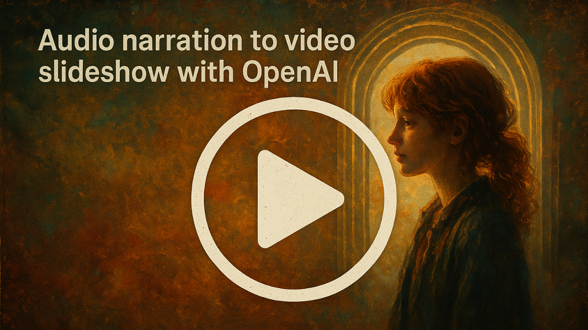

# Audio Narration → Video Slideshow

This is a web app made with Python, Flask, MoviePy and OpenAI that transforms an audio storytelling file into an enchanting video. Simply upload any audio narration, and this tool will:

- 🎙️ **Transcribe** your audio using the advanced speech recognition provided by OpenAI Whisper.
- ✂️ **Split** the transcript into multiple scenes, ensuring each segment of the story is neatly captured.
- 🖌️ **Generate** dynamic, illustrative images for each scene based on intelligent prompts and style guidelines.
- 🎞️ **Compose** a video by synchronizing the generated images with the original audio, crafting a cinematic outcome.

## Key Highlights

- 💫 **Automatic Story Extraction**: Detects characters, scenarios, and important items from your transcript, giving you a structured "story ingredients" overview.
- 🎨 **Whimsical Image Generation**: Transforms each scene into a painterly, whimsical illustration that reflects the heart of your story.
- 🪄 **One-Click Video Assembly**: Seamlessly merges the generated visuals with your narration into a final video, ready to play or share.
- 🌱 **Friendly Web Interface**: Upload audio, preview and regenerate images if needed, and watch your story bloom into a mini cinematic production.

## Demo

<a href="https://www.youtube.com/watch?v=F8QZhW9o7CQ">
  
</a>

Whether you’re narrating a fairy tale, sharing personal anecdotes, or preparing a memorable presentation, this tool helps you transform words into visuals—so every story can shine!

## Roadmap

- Integrate the new images API as soon as it comes out.
- Have a "project library of images". When generating an image, copy it to "the library", add a button to the image that allows "select from library" (always allow loading local files in there).
- Create Ken Burns sliding effect, better transitions

## Requirements

- Python 3.7+
- [ffmpeg](https://ffmpeg.org/download.html) installed on your system
- The packages in `requirements.txt`
- `.env` file with your `OPENAI_API_KEY`

## Setup a Virtual Environment

**Create** a virtual environment (e.g., named `venv`):
```bash
python -m venv venv
```
**Activate** the virtual environment:
```bash
On Windows:     venv\Scripts\activate
On macOS/Linux: source venv/bin/activate
```
**Install** the required packages:
```bash
pip install -r requirements.txt
```
**Create** a `.env` file in the root directory and add your OpenAI API key:
```bash
OPENAI_API_KEY=your_openai_api_key
```
**Run** the script:
```bash
python create_video.py ./demo/audio-file.mp3
```
--------------
Enjoy!
