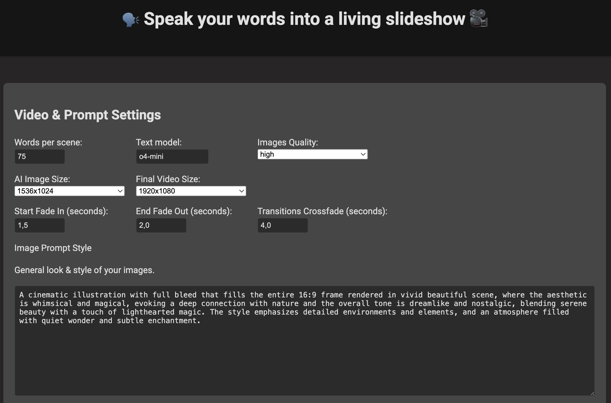
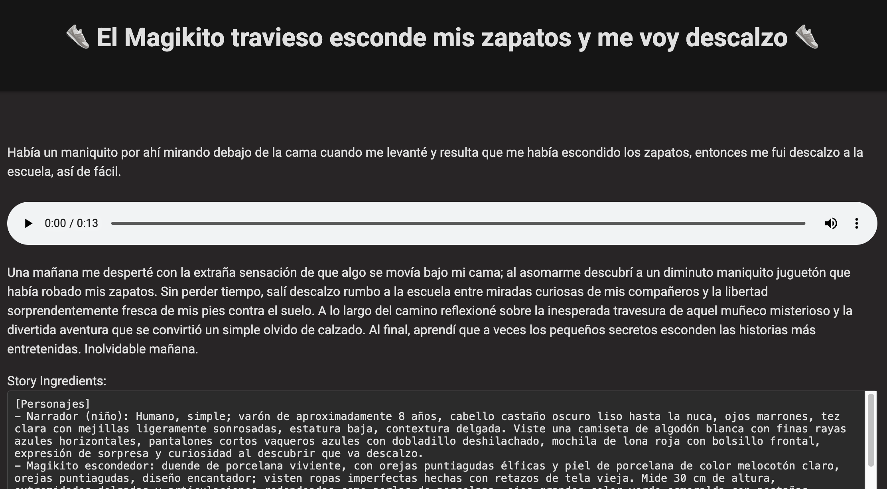
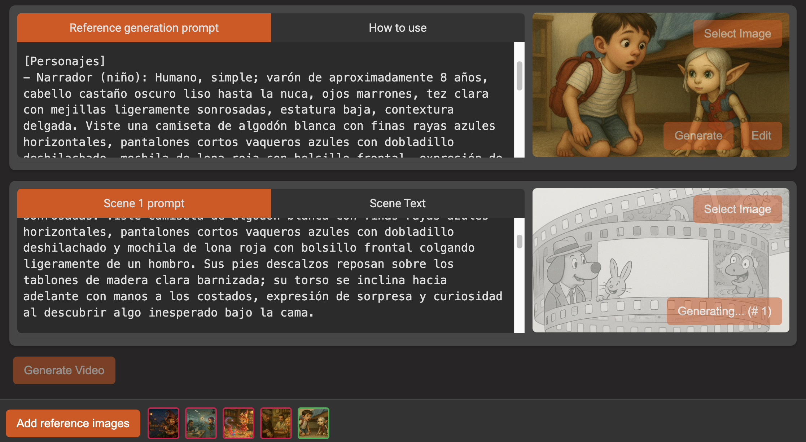

# Audio Narration → Video Slideshow

This is a web app made with Python, Flask, MoviePy and OpenAI that transforms an audio storytelling file into an enchanting video. Simply upload any audio narration, and this tool will:

- 🎙️ **Transcribe** your audio using the advanced speech recognition provided by OpenAI Whisper.
- ✂️ **Split** the transcript into multiple scenes, ensuring each segment of the story is neatly captured.
- 🖌️ **Generate** dynamic, illustrative images for each scene based on intelligent prompts and style guidelines.
- 🎞️ **Compose** a video by synchronizing the generated images with the original audio, crafting a cinematic outcome.

## Key Highlights

- 💫 **Automatic Story Extraction**: Detects characters, scenarios, and important items from your transcript, giving you a structured "story ingredients" overview.
- 🎨 **Whimsical Image Generation**: Transforms each scene into a painterly, whimsical illustration that reflects the heart of your story.
- 🪄 **One-Click Video Assembly**: Seamlessly merges the generated visuals with your narration into a final video, ready to play or share.
- 🌱 **Friendly Web Interface**: Upload audio, preview and regenerate images if needed, and watch your story bloom into a mini cinematic production.

## Demo

<a href="https://www.youtube.com/watch?v=F8QZhW9o7CQ">
  
</a>

Whether you’re narrating a fairy tale, sharing personal anecdotes, or preparing a memorable presentation, this tool helps you transform words into visuals—so every story can shine!

## A couple screenshots

You start by setting the options for the expected video size, the text model you want to use for prompt processing and narration details extraction, the quality with which you want to generate images, and your specific details for how your images should be styled.



Then you let the magic happen. The Whisper model will transcribe your narration and extract everything it needs. From a title and a description to all your story ingredients (characters, scenarios, items), based of course on the instructions you defined in the initial screen.



Once you have everything you need, the system will chunk your story into multiple scenes and prepopulate each scene with an autogenerated prompt that contains all your previous defined style, adjusted specifically for the current scene.



You will also have a place to generate reference images. Create and edit as many as you want and add them to your reference images collection. These images will be included in all your prompts, so you can have a better control for style and characters consistency. Add or remove reference images from the context just by clicking on them in the preview gallery.

Try it out for more!

## Requirements

- Python 3.7+
- [ffmpeg](https://ffmpeg.org/download.html) installed on your system
- The packages in `requirements.txt`
- `.env` file with your `OPENAI_API_KEY`

## Setup a Virtual Environment

**Create** a virtual environment (e.g., named `venv`):
```bash
python -m venv venv
```
### **Activate** the virtual environment.

On Windows:
```bash
venv\Scripts\activate
```
On macOS/Linux:
```bash
source venv/bin/activate
```
**Install** the required packages:
```bash
pip install -r requirements.txt
```
**Create** a `.env` file in the root directory and add your OpenAI API key:
```bash
OPENAI_API_KEY=your_openai_api_key
```
**Run** the script:
```bash
python create_video.py ./demo/audio-file.mp3
```

## Changelog

- `MAY 15, 2025:` Add overlay feature and allow deleting reference images.
- `APR 23, 2025:` Implement `gpt-image-1` model, image edition and references library.
- `APR 22, 2025:` Added feature to select local image and image cropping.
- `APR 21, 2025:` Added fade-in, fade-out and cross-fade transitions.
- `APR 18, 2025:` Liked the idea and added a UI for more control of each scene.
- `APR 17, 2025:` Had the idea and started the project as a simple script.